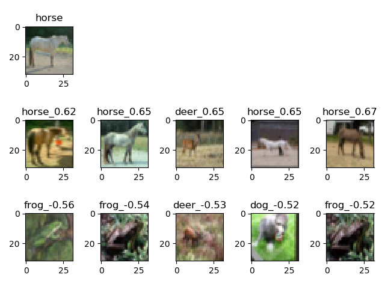
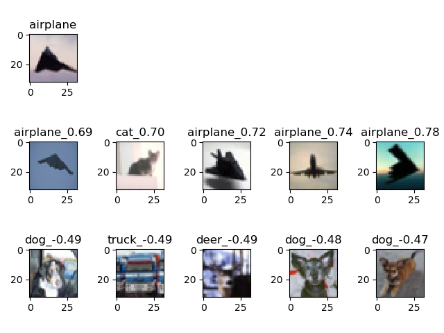

# MoCo
A pytorch reimplement of paper "Momentum Contrast for Unsupervised Visual Representation Learning"

Shuffle BN can be applied although there is only one gpu.

## Visualization
we randomly select an image (in the first row), and then find the most similar/dissimilar images with the largest/smallest dot product (in the second row and third row).

As seen, with unsupervised learning, the model can capture the similarity between images.
### case 1

### case 2

### case 3
